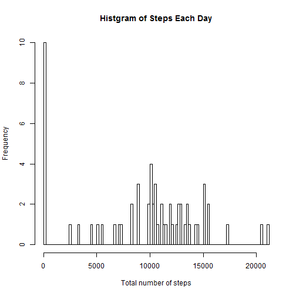
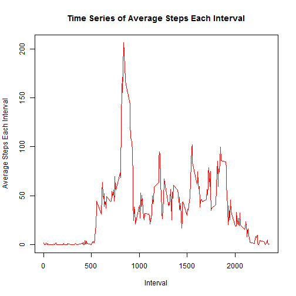
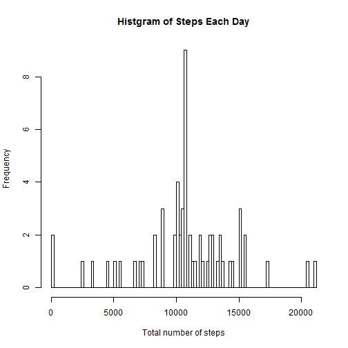
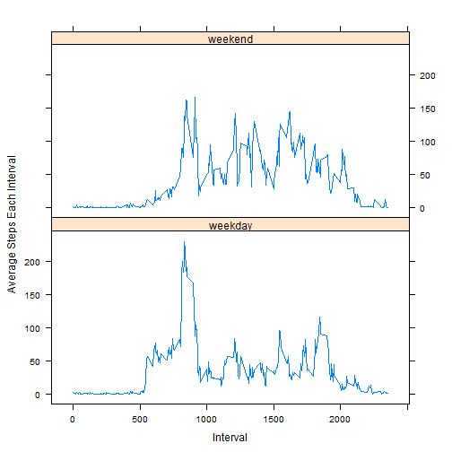

This files gives explanations of how the code works.

Read the file. Then make a histogram of the total number of steps taken each day by "hist" function. 

```r
activity <- read.csv("activity.csv")
num <- tapply(activity$steps, activity$date, sum, na.rm=T)
hist(num, main = "Histgram of Steps Each Day", 
     xlab = "Total number of steps", breaks = 100)
```



Calculated the value of mean and median of the total number of steps taken per day.

```r
mean(num)
```

```
## [1] 9354.23
```

```r
median(num)
```

```
## [1] 10395
```

Make the time series plot of the 5-minute interval and the average number of steps taken, averaged across all days.

```r
steps <- tapply(activity$steps, activity$interval, mean, na.rm=T)
interval <- as.numeric(levels(as.factor(activity$interval)))
plot(interval, steps, type = "l", col = "red", 
     main = "Time Series of Average Steps Each Interval",
     xlab = "Interval", ylab = "Average Steps Each Interval")
```



Get the 5-minute interval in which the average number of steps across all the days has the maximum by "which.max" function.

```r
averagedata <- data.frame(steps = steps, interval = interval)
averagedata$interval[which.max(averagedata$steps)]
```

```
## [1] 835
```

Calculate and report the total number of missing values in the dataset.

```r
sum(is.na(activity$steps))
```

```
## [1] 2304
```

Fill in all of the missing values in the dataset by the mean for that 5-minute interval and create a new dataset that is equal to the original dataset but with the missing data filled in.

```r
allaveragesteps <- rep(steps, length(levels(as.factor(activity$date))))
newact <- activity
newact$steps[is.na(activity$steps)] <- allaveragesteps[is.na(activity$steps)]
```

Make a histogram of the total number of steps taken each day.

```r
newnum <- tapply(newact$steps, newact$date, sum, na.rm=T)
hist(newnum, main = "Histgram of Steps Each Day", 
     xlab = "Total number of steps", breaks = 100)
```



Calculate and report the mean and median total number of steps taken per day

```r
mean(newnum)
```

```
## [1] 10766.19
```

```r
median(newnum)
```

```
## [1] 10766.19
```
The mean and median value of steps each day in the new data set has increased since the missing value is imputed. And the total number of daily steps increases.

Create a new factor variable in the dataset with two levels -- "weekday" and "weekend" indicating whether a given date is a weekday or weekend day. (Since the OS of my computer is in Chinese, I use "Saturday" and "Sunday" in Chinese in my code)

```r
days <- weekdays(as.Date(activity$date))
newact$day <- as.factor(ifelse(days=="星期六"|days=="星期日", "weekend", "weekday"))
```

Make the panel plot containing a time series plot of the 5-minute interval and the average number of steps taken, averaged across all weekday days or weekend days.

```r
weekdaydata <- subset(newact, newact$day == "weekday")
weekdaymean <- tapply(weekdaydata$steps, weekdaydata$interval, mean, na.rm=T)
weekenddata <- subset(newact, newact$day == "weekend")
weekendmean <- tapply(weekenddata$steps, weekenddata$interval, mean, na.rm=T)
Mean <- c(weekdaymean, weekendmean)
Interval <- rep(interval, 2)
Day <- as.factor(c(rep("weekday", length(interval)), rep("weekend", length(interval))))
Data <- data.frame(Mean = Mean, Interval = Interval, Day = Day)
library(lattice)
xyplot(Mean~Interval|Day, data = Data, type = "l", layout= c(1,2),
       ylab = "Average Steps Each Interval")
```




